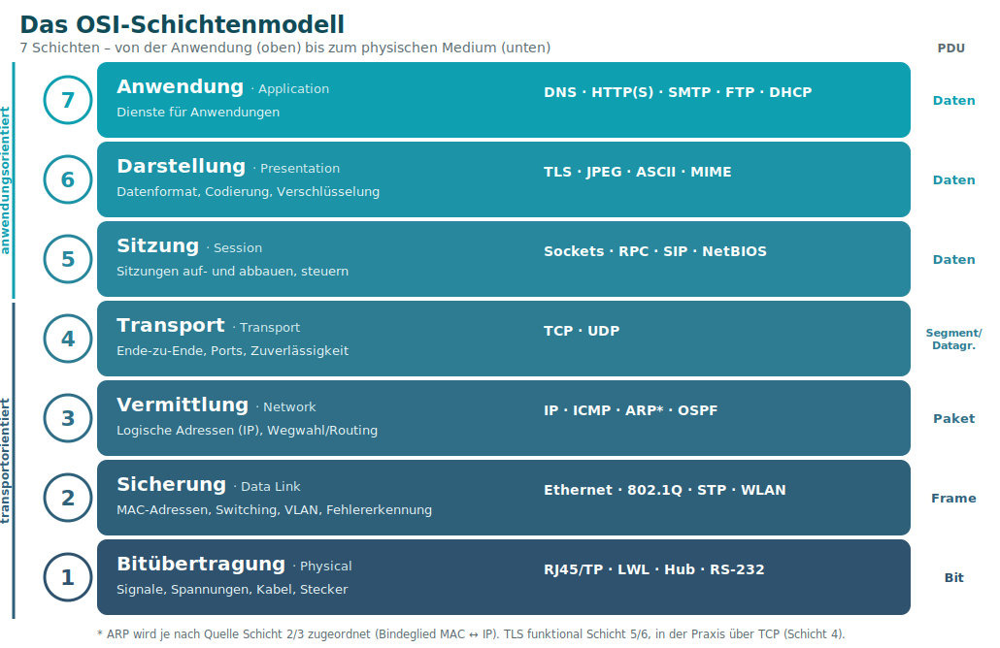
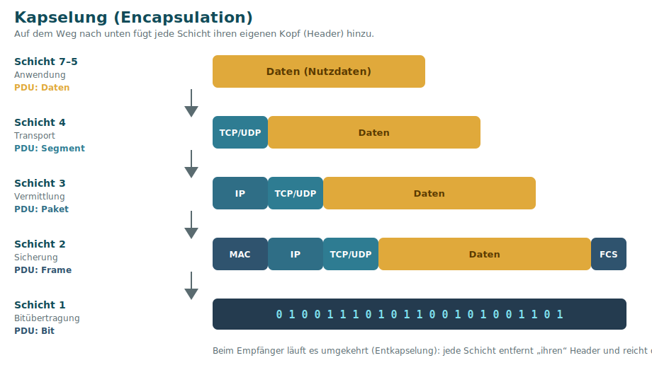

# 1 · Das OSI-Schichtenmodell

Das **OSI-Modell** (Open Systems Interconnection) ist ein Referenzmodell, das die Kommunikation in Netzwerken in **7 Schichten** zerlegt. Jede Schicht hat eine klar abgegrenzte Aufgabe und nutzt die Dienste der Schicht **darunter**. So lassen sich Probleme einordnen und Hersteller können Geräte standardisiert zusammenarbeiten lassen.

## Die 7 Schichten auf einen Blick

| # | Schicht (DE / EN) | Aufgabe | PDU | Beispiele | Gerät |
|:-:|-------------------|---------|-----|-----------|-------|
| 7 | Anwendung · *Application* | Dienste für Anwendungen | Daten | HTTP(S), DNS, SMTP, FTP, DHCP | Firewall (L7) |
| 6 | Darstellung · *Presentation* | Codierung, Formate, Verschlüsselung | Daten | TLS, JPEG, ASCII, MIME | – |
| 5 | Sitzung · *Session* | Sitzungen auf-/abbauen | Daten | Sockets, RPC, SIP | – |
| 4 | Transport · *Transport* | Ende-zu-Ende, Ports, Zuverlässigkeit | **Segment** (TCP) / Datagramm (UDP) | TCP, UDP | – |
| 3 | Vermittlung · *Network* | Logische Adressen, Wegwahl (Routing) | **Paket** | IP, ICMP, ARP\*, OSPF | Router, L3-Switch |
| 2 | Sicherung · *Data Link* | MAC-Adressen, Switching, Fehlererkennung | **Frame** | Ethernet, 802.1Q, STP, WLAN | Switch, Bridge |
| 1 | Bitübertragung · *Physical* | Signale, Spannungen, Kabel, Stecker | **Bit** | RJ45/TP, LWL, RS-232 | Hub, Repeater |

> \* **ARP** vermittelt zwischen MAC (Schicht 2) und IP (Schicht 3) und wird je nach Quelle Schicht 2 oder 3 zugeordnet. **TLS** ist funktional Schicht 5/6, läuft praktisch aber über TCP (Schicht 4).

## Merkhilfen (Eselsbrücken)

- **Von 7 → 1:** **A**lle **D**eutschen **S**chüler **T**rinken **V**erschiedene **S**äfte **B**ier
- **Von 1 → 7:** **B**itte **S**chütze **V**or **T**eurem **S**erver **D**eine **A**nwendung
- Geräte-Merksatz: **Hub = Schicht 1, Switch = Schicht 2, Router = Schicht 3.**

## Kapselung (Encapsulation)

Auf dem Weg **nach unten** fügt jede Schicht ihren eigenen Kopf (**Header**) hinzu – aus *Daten* wird ein *Segment*, daraus ein *Paket*, daraus ein *Frame*, daraus *Bits*. Beim Empfänger läuft es umgekehrt (**Entkapselung**): jede Schicht entfernt „ihren“ Header und reicht den Rest nach oben.

Das erklärt auch ein wichtiges Detail aus der Praxis: Eine **MAC-Adresse** (Schicht 2) ist nur im lokalen Netz gültig, während die **IP-Adresse** (Schicht 3) über das ganze Netz hinweg gilt. Auf jedem Router-Hop wird der Frame-Header (L2) neu gebildet, der IP-Header (L3) bleibt – nur die TTL sinkt.

## OSI-Modell vs. TCP/IP-Modell

In der Praxis wird oft das schlankere **TCP/IP-Modell** verwendet. Es fasst mehrere OSI-Schichten zusammen:

| TCP/IP-Modell | entspricht OSI-Schicht | Beispiele |
|---------------|------------------------|-----------|
| Anwendung | 5–7 | HTTP, DNS, FTP, SMTP |
| Transport | 4 | TCP, UDP |
| Internet | 3 | IP, ICMP |
| Netzzugang | 1–2 | Ethernet, WLAN |

## Warum ist das wichtig?

Das OSI-Modell ist das **Ordnungsprinzip** für die gesamte Fehlersuche und Planung:

- **Troubleshooting** läuft von unten nach oben: erst Kabel (1), dann IP (3), dann DNS (7).
- Jedes **Gerät** lässt sich einer Schicht zuordnen → siehe [Netzwerkgeräte](08-Netzwerkgeraete.md).
- Jedes **Protokoll** „lebt“ auf einer Schicht → siehe [Protokoll-Referenz](10-Protokoll-und-Port-Referenz.md).

---
[◀ Übersicht](README.md) · **Weiter:** [Schicht 1 – Bitübertragung ▶](02-Schicht-1-Bituebertragung.md)
