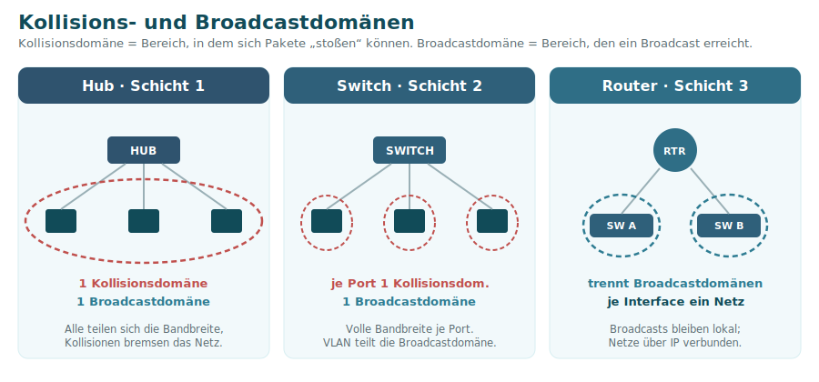
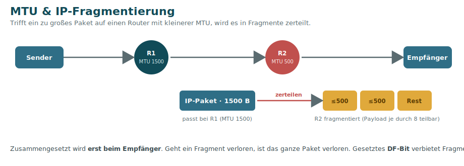
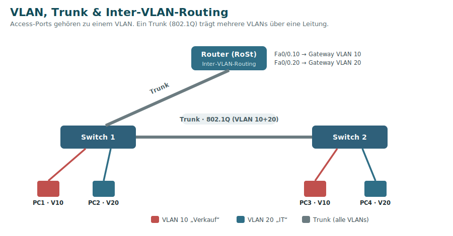

# 3 · Schicht 2 – Sicherung (Data Link)

Die Sicherungsschicht macht aus den rohen Bits **Frames** und sorgt für die Übertragung im **lokalen Netz**. Sie nutzt **physikalische Adressen (MAC)**, erkennt Übertragungsfehler (FCS/CRC) und regelt den Medienzugriff. Zentrales Gerät: der **Switch**.

## MAC-Adresse

Die **MAC-Adresse** (Media Access Control) ist die fest in die Netzwerkkarte gebrannte 48-Bit-Adresse, notiert in Hex:

```
00:1B:44:11:3A:B7
└──┬───┘ └──┬───┘
  OUI       gerätespezifischer Teil
(Hersteller)
```

- **48 Bit** = 6 Byte, die ersten 3 Byte (**OUI**) kennzeichnen den Hersteller.
- **Broadcast-MAC:** `FF:FF:FF:FF:FF:FF` (an alle).
- Gilt **nur im lokalen Netz** – über Router hinweg wird sie an jedem Hop ersetzt (die IP bleibt).

## Der Ethernet-Frame (vereinfacht)

| Präambel | Ziel-MAC | Quell-MAC | *(802.1Q-Tag)* | Typ/Länge | Daten (Nutzlast) | FCS |
|----------|----------|-----------|----------------|-----------|------------------|-----|

Die **FCS** (Frame Check Sequence, eine CRC-Prüfsumme) am Ende erkennt Übertragungsfehler – fehlerhafte Frames werden verworfen.

## Der Switch

Ein Switch vermittelt Frames gezielt anhand der **MAC-Adresstabelle**:

1. **Lernen:** Aus der **Quell-MAC** eingehender Frames merkt sich der Switch, an welchem Port welche MAC hängt.
2. **Weiterleiten (Forwarding):** Ist die **Ziel-MAC** bekannt, geht der Frame **nur** an den richtigen Port.
3. **Fluten (Flooding):** Ist die Ziel-MAC **unbekannt** (unknown unicast) oder ein **Broadcast**, geht der Frame an **alle** Ports (außer den Eingangsport).
4. **Altern (Aging):** Einträge verfallen nach einer Zeit (z. B. 300 s) – so bleibt die Tabelle aktuell, wenn Geräte den Port wechseln.

Jeder Switch-Port ist eine **eigene Kollisionsdomäne** und arbeitet im **Vollduplex** – Kollisionen gibt es praktisch nicht mehr (das alte Zugriffsverfahren **CSMA/CD** ist damit hinfällig).

> 🛈 Nur ein **Managed Switch** (intern ein kleiner Rechner mit Weboberfläche) ist konfigurierbar und beherrscht Funktionen wie VLANs, STP oder Priorisierung.

### Switching-Modi

Wie viel prüft der Switch, bevor er weiterleitet?

| Modus | Wartet auf | Verhalten |
|-------|-----------|-----------|
| **Cut-Through** | 6 Byte (Ziel-MAC) | leitet fast sofort weiter – schnell, aber **keine** Fehlerprüfung |
| **Fragment-Free** | 64 Byte | verwirft Kollisionsfragmente (Frames < 64 Byte) |
| **Store-and-Forward** | kompletten Frame | prüft die **CRC**, verwirft fehlerhafte Frames – sicher, aber langsamer |

## Kollisions- vs. Broadcastdomänen



| Gerät | Kollisionsdomänen | Broadcastdomänen |
|-------|-------------------|------------------|
| **Hub** (L1) | 1 (alle gemeinsam) | 1 |
| **Switch** (L2) | 1 **pro Port** | 1 (ein VLAN) |
| **Router** (L3) | – | **trennt** sie (je Interface eins) |

**Broadcast-Adressen:** MAC `FF:FF:FF:FF:FF:FF`, IPv4 `255.255.255.255` (oder die letzte Adresse eines Netzes). Typische Broadcast-Protokolle: **ARP, DHCP, SMB, Wake-on-LAN**. **Switches, Bridges und Hubs leiten Broadcasts weiter – Router nicht.** Deshalb begrenzen Router (und VLANs) die Broadcastdomäne.

## MTU & Fragmentierung

Die **MTU** (Maximum Transmission Unit) ist die **maximale Größe eines IP-Pakets**, das über ein Netz gesendet werden kann – üblich **1500 Byte**. Ein Ethernet-Frame fasst max. **1500 Byte Payload** (inkl. aller Header **1518 Byte**).



- Ist ein Paket **größer** als die MTU eines Routers auf der Strecke, muss es **fragmentiert** (zerteilt) werden; zusammengesetzt wird es **erst beim Empfänger**.
- Probleme: Fragmentierung **bremst**, erzeugt **Overhead** – und geht **ein** Fragment verloren, ist das **ganze** Paket verloren.
- Die **Payload** eines Fragments muss **durch 8 teilbar** sein (Offset-Feld im IP-Header).
- Das **DF-Bit** („Don't Fragment") verbietet das Zerteilen → der Router **verwirft** das Paket und meldet es per **ICMP**. Das **MF-Bit** („More Fragments") zeigt an, dass weitere Fragmente folgen.

> 🔧 **MTU einer Strecke ermitteln** (Windows) – mit gesetztem DF-Bit pingen und die Größe annähern:
> ```powershell
> ping -f -l 1472 8.8.8.8
> ```
> `-f` = DF setzen, `-l 1472` = Payloadgröße. **1472** = 1500 − 20 (IP) − 8 (ICMP).

## STP – Spanning Tree Protocol (IEEE 802.1D)

Redundante Verbindungen zwischen Switches erhöhen die Ausfallsicherheit – erzeugen aber **Schleifen (Loops)**. Ein Broadcast würde endlos kreisen (**Broadcast-Sturm**) und das Netz lahmlegen. Grund: **Ethernet hat keinen TTL-Zähler** (den gibt es erst im IP-Header) – ein Switch erkennt nicht, wie oft ein Frame ihn schon durchquert hat. *Soforthilfe bei versehentlichem Loop: das doppelte Kabel ziehen.* **STP** verhindert das, indem es ein **schleifenfreies Baumdiagramm** aufbaut:

1. Wahl der **Root-Bridge** = Switch mit der **niedrigsten Bridge-ID** (Priorität + MAC-Adresse).
2. Jeder andere Switch bestimmt seinen besten Weg zur Root (**Root-Port**).
3. Pro Segment wird ein **Designated-Port** bestimmt.
4. Überzählige Wege werden in den **Blocking-Zustand** versetzt – sie sind „in Reserve“.
5. Verständigung über **BPDUs** (Bridge Protocol Data Units).

Fällt ein aktiver Weg aus, aktiviert STP einen blockierten. Der **Root Port** ist der Port mit den geringsten **Pfadkosten** zur Root (Summe der Leitungsgeschwindigkeiten auf dem Weg).

| Protokoll | Konvergenz (Neuaufbau) | Redundante Pfade |
|-----------|------------------------|------------------|
| **STP** (802.1D) | 30–50 s | bleiben ungenutzt |
| **RSTP** (802.1w) | ~6 s | bleiben ungenutzt |
| **SPB** (Shortest Path Bridging) | – | **alle** gleich teuren Pfade aktiv → echte Lastverteilung |

## VLAN – Virtuelles LAN (IEEE 802.1Q)

Ein **VLAN** unterteilt ein physisches Netz in mehrere **logische Teilnetze**. Geräte werden nach **Funktion/Abteilung** gruppiert statt nach Standort.

**Vorteile:**
- **Trennt Broadcastdomänen** → kleinere Broadcastbereiche, weniger Broadcast-Stürme.
- **Sicherheit:** sensibler Verkehr ist von anderem getrennt.
- **Logische Gruppierung** unabhängig vom Standort; Priorisierung über **CoS**.

> 📌 Ein VLAN bildet eine **eigene Broadcastdomäne** – aber **keine** eigene Kollisionsdomäne (die liegt pro Switch-Port).

### Tagging, Access- und Trunk-Ports
- **Access-Port:** gehört zu **einem** VLAN, verbindet Endgeräte (PC, Drucker).
- **Trunk-Port:** trägt **mehrere** VLANs über **eine** Leitung (zwischen Switches oder zum Router). Die Frames werden dazu mit einem **VLAN-Tag** versehen.
- Der **VLAN-Tag** (4 Byte) wird **nach** Ziel- und Quell-MAC eingefügt – so können auch Switches **ohne** VLAN-Funktion die Frames noch weiterleiten. Am **Access-Port wird der Tag wieder entfernt**, bevor der Frame zum Client geht – die Endgeräte merken vom VLAN nichts.
- Die **VLAN-ID** ist **12 Bit** lang → 2¹² = 4096, davon nutzbar **4094** (VLAN 0 und 4095 sind reserviert).

### Zuordnung
- **Statisch (portbasiert):** Ein Switch-Port wird fest einem VLAN zugewiesen (Standardfall).
- **Dynamisch:** Zuordnung anhand von MAC-Adresse, Benutzername, Gerätetyp (z. B. IP-Telefon) usw.

### Inter-VLAN-Routing & Router-on-a-Stick
Damit Hosts **VLAN-übergreifend** kommunizieren, muss der Verkehr **geroutet** werden (Schicht 3) – über einen **Router** oder einen **Layer-3-Switch**.



Beim **Router-on-a-Stick** ist der Router über **einen** Trunk angebunden. Pro VLAN wird ein **Sub-Interface** mit `encapsulation dot1q <VID>` angelegt, das als **Default-Gateway** dieses VLANs dient:

```
Router(config)# interface fa0/0.10
Router(config-subif)# encapsulation dot1q 10
Router(config-subif)# ip address 192.168.1.254 255.255.255.0
Router(config-subif)# interface fa0/0.20
Router(config-subif)# encapsulation dot1q 20
Router(config-subif)# ip address 192.168.2.254 255.255.255.0
```

## ARP – Address Resolution Protocol

ARP ist das **Bindeglied zwischen Schicht 2 und 3**: Es findet zu einer bekannten **IP-Adresse** die zugehörige **MAC-Adresse** im lokalen Netz.

1. **ARP-Request** (Broadcast): „Wer hat 192.168.1.10? Sag es 192.168.1.20.“
2. **ARP-Reply** (Unicast): „192.168.1.10 ist bei MAC 00:1B:44:…“.
3. Ergebnis landet im **ARP-Cache** (anzeigen mit `arp -a`).

Die Umkehrung – **MAC → IP** – leistet **RARP** (Reverse ARP).

---
[◀ Schicht 1](02-Schicht-1-Bituebertragung.md) · [Übersicht](README.md) · **Weiter:** [Schicht 3 – Vermittlung ▶](04-Schicht-3-Vermittlung.md)
