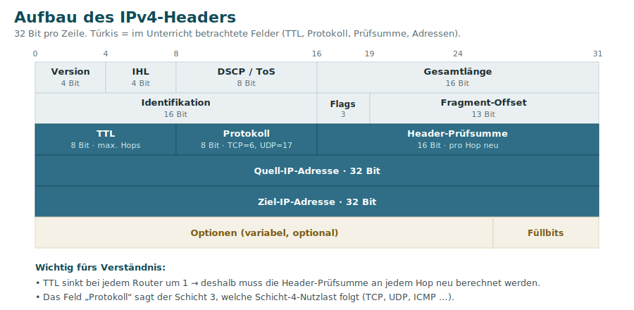
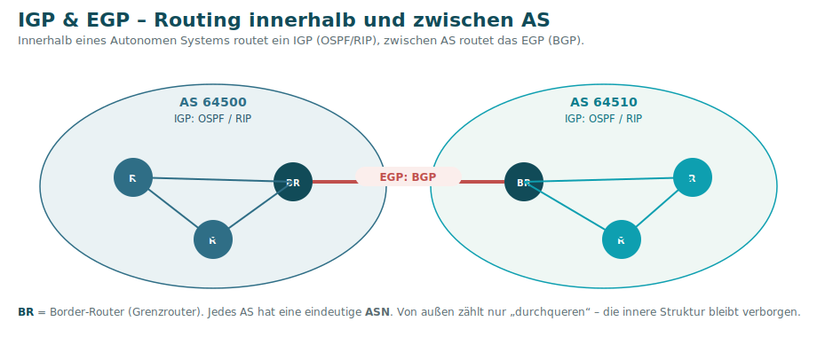
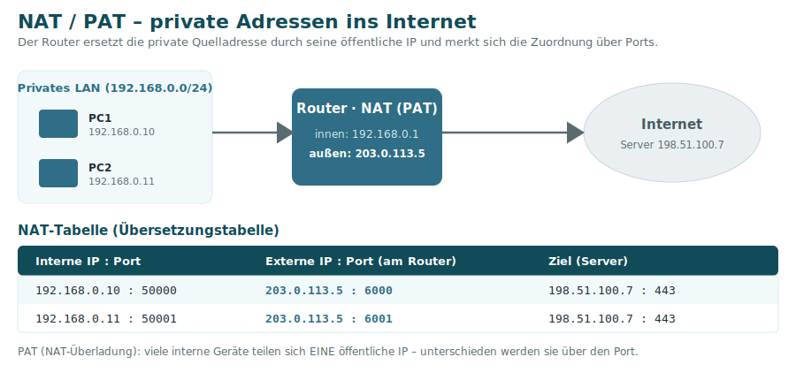

# 4 · Schicht 3 – Vermittlung (Network)

Die Vermittlungsschicht sorgt für die **logische Adressierung (IP)** und die **Wegwahl über Netzgrenzen hinweg (Routing)**. Während Schicht 2 nur im lokalen Netz arbeitet, verbindet Schicht 3 **verschiedene Netze**. Zentrales Gerät: der **Router**.

> Alles zur **IP-Adresse, Subnetzmaske und zum Subnetting** (IPv4 **und** IPv6) steht auf der eigenen Seite [IP-Adressierung & Subnetting](05-IP-Adressierung-und-Subnetting.md). Diese Seite behandelt **Router, Routing, ICMP, NAT** und den IPv4-Header.

## Der IPv4-Header

Wichtige Felder (im Unterricht betrachtet):

| Feld | Bedeutung |
|------|-----------|
| **TTL** (Time To Live) | Zähler für die **maximale Anzahl Router (Hops)**. Jeder Router zieht 1 ab; bei 0 wird das Paket verworfen → verhindert „ewig kreisende“ Pakete. |
| **Protokoll** | Welche Schicht-4-Nutzlast folgt: **TCP = 6, UDP = 17, ICMP = 1**. |
| **Header-Prüfsumme** | Sichert den Header. **Muss an jedem Hop neu berechnet werden**, weil sich die TTL bei jedem Router ändert. |
| **Quell-/Ziel-IP** | Je 32 Bit – logische Absender- und Empfängeradresse. |

## ICMP – das Diagnoseprotokoll

**ICMP** (Internet Control Message Protocol) transportiert Status- und Fehlermeldungen auf Schicht 3:

- Grundlage von **`ping`** (Echo Request / Echo Reply) und **`tracert`**.
- Typische Meldungen: *Destination Unreachable*, *Time Exceeded* (TTL abgelaufen – nutzt `tracert`, um Hops sichtbar zu machen).
- **Hinweis:** Firewalls blockieren ICMP häufig → ein fehlender Ping bedeutet nicht zwingend „offline“.

## Router & Routing

Ein **Router** verbindet Netze und entscheidet anhand der **Ziel-IP** und seiner **Routingtabelle**, über welches Interface ein Paket weitergeleitet wird.

- **Default-Route** `0.0.0.0/0` = „Gateway of last resort“ – wohin alles geht, wofür es keine spezifischere Route gibt.
- **Direkt verbundene Netze** kennt der Router automatisch.

### Statisches vs. dynamisches Routing

| | Statisch | Dynamisch |
|--|----------|-----------|
| Pflege | manuell eingetragen | Router tauschen Infos automatisch aus |
| Reaktion auf Ausfälle | keine (manuell) | passt sich selbst an |
| Eignung | kleine, stabile Netze | große, veränderliche Netze |

### IGP & EGP – Autonome Systeme (AS)

Das Internet besteht aus sehr vielen Netzen. Man fasst sie zu **Autonomen Systemen (AS)** zusammen – jedes mit einer eindeutigen **ASN** (z. B. ein ISP, ein Carrier, eine Universität). Von außen zählt nur, ein AS zu **durchqueren**; wie es innen aussieht, bleibt verborgen.

- **IGP** (Interior Gateway Protocol) – routet **innerhalb** eines AS: **OSPF, RIP, EIGRP**.
- **EGP** (Exterior Gateway Protocol) – routet **zwischen** AS (über die ASN): praktisch nur **BGP**.

### Dynamische Routingprotokolle

| Protokoll | Typ | Metrik | Besonderheit |
|-----------|-----|--------|--------------|
| **RIP** | Distance-Vector | **Hop-Count** (max. **15**; 16 = unerreichbar) | einfach; Schleifenschutz: Split Horizon, Route Poisoning, Hold-Down-Timer |
| **OSPF** | Link-State | **Cost** = Referenz-BW / Interface-BW | kennt die ganze „Netzkarte“, berechnet kürzesten Pfad per **Dijkstra**; IGP |
| **EIGRP** | Hybrid | Mischung (u. a. Bandbreite, Verzögerung) | ursprünglich Cisco-proprietär, heute offen |
| **BGP** | Path-Vector | Pfad-Attribute | **EGP** – verbindet autonome Systeme (das „Internet-Routing”) |

> Die meisten IGPs gibt es in IPv4- **und** IPv6-Varianten: **OSPFv2 / OSPFv3**, **RIPv2 / RIPng**, **EIGRP / EIGRP for IPv6**. Der Bewertungsmaßstab „bester Weg” heißt **Metrik**, die Dauer bis zum stabilen Routing **Konvergenzzeit**.

> **Distance-Vector** (RIP): „Ich kenne nur Richtung und Entfernung, die mir mein Nachbar nennt.“
> **Link-State** (OSPF): „Ich kenne die komplette Karte des Netzwerks.“

### Administrative Distance (AD)
Kennt ein Router mehrere Wege zum selben Ziel aus **verschiedenen Quellen**, entscheidet die **AD** (Vertrauenswürdigkeit – **kleiner = vertrauenswürdiger**):

| Quelle | AD |
|--------|:--:|
| Direkt verbundenes Netz | 0 |
| Statische Route | 1 |
| eBGP (extern) | 20 |
| OSPF | 110 |
| RIP | 120 |

## NAT – Network Address Translation

**NAT** übersetzt zwischen **privaten** (internen) und **öffentlichen** IP-Adressen. Grund: Es gibt zu wenige öffentliche IPv4-Adressen – im LAN nutzt man private Bereiche (siehe [Subnetting](05-IP-Adressierung-und-Subnetting.md)), nach außen tritt man mit einer öffentlichen IP auf.

- **PAT (NAT-Überladung):** Viele interne Geräte teilen sich **eine** öffentliche IP – unterschieden über den **Port**. (Der Heimrouter-Standardfall.)
- **Portweiterleitung / Destination NAT (DNAT):** Anfragen von außen auf einen Port werden gezielt an einen internen Server geleitet (z. B. Webserver `:80`). ⚠️ **Nur mit [DMZ](09-Sicherheit-Firewall-DMZ-WLAN.md) absichern!**
- Der Router führt dazu eine **NAT-Tabelle** (interne IP:Port ↔ externe IP:Port).

## APIPA – wenn DHCP versagt

Bekommt ein Gerät **per DHCP keine Adresse**, vergibt es sich selbst eine **APIPA-Adresse** aus `169.254.0.0/16`. Diese wird **nicht geroutet** → kein Internet. Eine 169.254-Adresse ist also ein klares Zeichen: *DHCP nicht erreichbar* (siehe [Troubleshooting](13-Troubleshooting.md)).

---
[◀ Schicht 2](03-Schicht-2-Sicherung.md) · [Übersicht](README.md) · **Weiter:** [IP-Adressierung & Subnetting ▶](05-IP-Adressierung-und-Subnetting.md)
