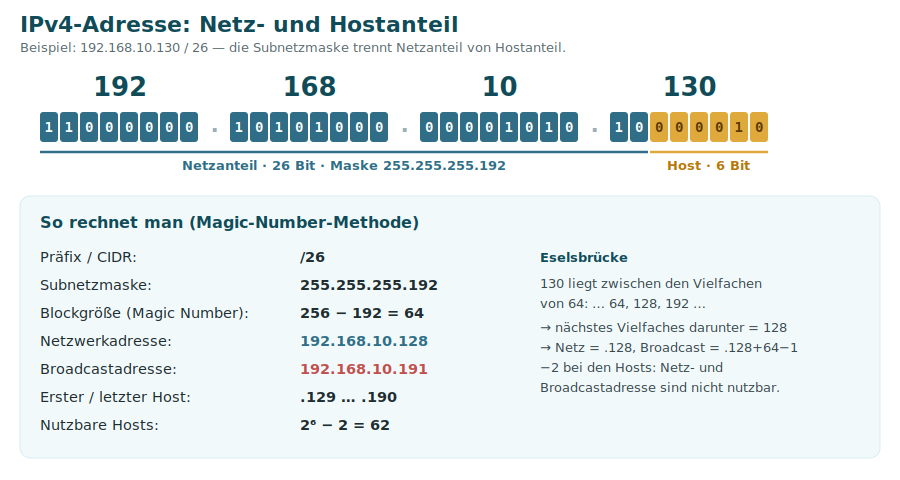
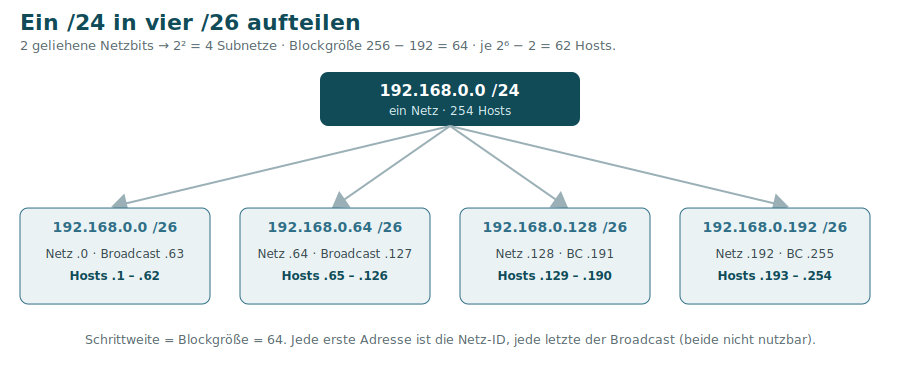
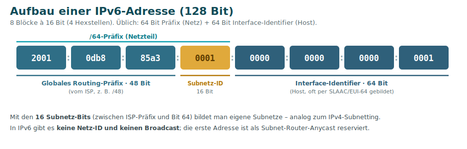
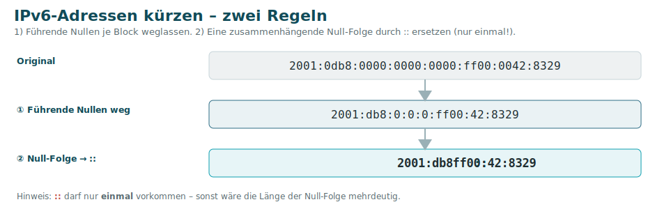
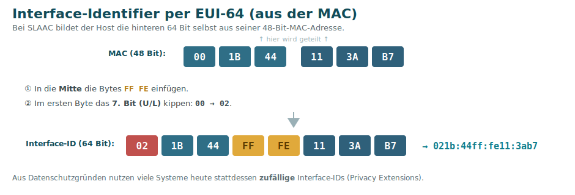

# 5 · IP-Adressierung & Subnetting

Diese Seite gehört thematisch zu [Schicht 3](04-Schicht-3-Vermittlung.md), ist aber wegen ihres Umfangs eigenständig. Sie erklärt **IPv4-Adressen & Subnetting** ausführlich und danach **IPv6**.

---

# Teil 1 · IPv4-Grundlagen

## Aufbau einer IPv4-Adresse

Eine **IPv4-Adresse** ist **32 Bit** lang und wird in vier **Oktetten** (je 8 Bit = 0–255) dezimal geschrieben, z. B. `192.168.10.130`. Die **Subnetzmaske** legt fest, welcher Teil das **Netz** und welcher den **Host** bezeichnet.



- **Netzanteil** = gemeinsame Kennung aller Geräte im selben Netz.
- **Hostanteil** = die individuelle Nummer des Geräts.
- **CIDR-Schreibweise** `/26` = Anzahl der Netzbits (hier 26).

## Die Subnetzmaske als „Schablone"

Die Subnetzmaske ist ebenfalls **32 Bit** lang und besteht aus einer **lückenlosen Folge von Einsen (Netz) gefolgt von Nullen (Host)**. Legt man sie über die IP-Adresse, trennt der Übergang von **1 zu 0** Netz- von Hostanteil:

```
IP-Adresse    192.168.10.130   11000000.10101000.00001010.10000010
Subnetzmaske  255.255.255.192  11111111.11111111.11111111.11000000
                               └────────── Netz ──────────┘└ Host ┘
```

> Weil die Einsen lückenlos von links kommen, gibt es nur 8 mögliche Werte je Oktett: **128, 192, 224, 240, 248, 252, 254, 255**.

## IPv4-Netzklassen (historisch)

Früher war der Netzanteil über feste **Klassen** vorgegeben (am ersten Oktett erkennbar):

| Klasse | 1. Bits | 1. Oktett | Standardmaske | Zweck |
|:------:|:-------:|:---------:|:-------------:|-------|
| **A** | 0 | 1–126 | /8 | sehr große Netze (~16,7 Mio. Hosts) |
| **B** | 10 | 128–191 | /16 | mittlere Netze (65 534 Hosts) |
| **C** | 110 | 192–223 | /24 | kleine Netze (254 Hosts) |
| **D** | 1110 | 224–239 | – | **Multicast** |
| **E** | 1111 | 240–255 | – | reserviert / experimentell |

> ⚠️ Das **klassenbasierte** Modell ist seit 1993 durch **CIDR** (Classless Inter-Domain Routing) abgelöst: Die Maske ist **frei wählbar** (`/n`), unabhängig von der Klasse. `127.0.0.0/8` ist als **Loopback** reserviert.

## Private Adressbereiche (RFC 1918) & Sonderadressen

| Bereich | CIDR | Verwendung |
|---------|------|-----------|
| 10.0.0.0 – 10.255.255.255 | /8 | privates LAN (groß) |
| 172.16.0.0 – 172.31.255.255 | /12 | privates LAN (mittel) |
| 192.168.0.0 – 192.168.255.255 | /16 | privates LAN (klein/Heim) |
| 127.0.0.1 | /8 | Loopback (eigener Rechner) |
| 169.254.0.0 – 169.254.255.255 | /16 | APIPA (DHCP fehlgeschlagen) |

Private Adressen sind **nicht öffentlich routbar** → der Weg ins Internet läuft über [NAT](04-Schicht-3-Vermittlung.md#nat--network-address-translation).

---

# Teil 2 · Subnetting (IPv4)

**Subnetting** teilt einen Adressraum in kleinere Subnetze – für **weniger Broadcast**, **mehr Sicherheit** (Trennung) und eine **organisatorische** Gliederung. Man **leiht** sich dazu Bits vom Host- für den Netzanteil. Die Summe bleibt immer **32 Bit**: mehr Netzbits = mehr Netze, aber weniger Hosts je Netz.

## Die wichtigsten Rechengrößen

| Größe | Formel |
|-------|--------|
| **Hostbits** `h` | 32 − Präfix |
| **nutzbare Hosts** | **2ʰ − 2** (Netz- und Broadcastadresse abziehen) |
| **Anzahl Subnetze** | 2ⁿ (n = geliehene Netzbits) |
| **Blockgröße** („Magic Number") | 256 − Wert des „interessanten" Maskenoktetts |

### Referenztabelle (letztes Oktett)

| CIDR | Subnetzmaske | Blockgröße | nutzbare Hosts |
|:----:|--------------|:----------:|:--------------:|
| /24 | 255.255.255.0 | 256 | 254 |
| /25 | 255.255.255.128 | 128 | 126 |
| /26 | 255.255.255.192 | 64 | 62 |
| /27 | 255.255.255.224 | 32 | 30 |
| /28 | 255.255.255.240 | 16 | 14 |
| /29 | 255.255.255.248 | 8 | 6 |
| /30 | 255.255.255.252 | 4 | 2 |

## Netzadresse & Broadcast bestimmen

- **Netzadresse:** alle **Hostbits auf 0** (bzw. IP **UND** Maske).
- **Broadcastadresse:** alle **Hostbits auf 1**.

```
IP            192.168.10.130   ...........10000010
Maske /26     255.255.255.192  ...........11000000
Netzadresse   192.168.10.128   ...........10000000   (Hostbits = 0)
Broadcast     192.168.10.191   ...........10111111   (Hostbits = 1)
Hosts         192.168.10.129 – 192.168.10.190        (62 Adressen)
```

**Magic-Number-Kurzweg:** Blockgröße = 256 − 192 = **64** → Vielfache 0, 64, **128**, 192 → 130 liegt im Block **128** → Netz `.128`, Broadcast `.128 + 64 − 1 = .191`.

## Weg A — nach Anzahl der **Netze** unterteilen

Beispiel: **192.168.0.0 /24** in **4** gleich große Subnetze.

- 4 Netze → **2 zusätzliche Netzbits** (2² = 4) → `/24 → /26`.
- Blockgröße 64 → die vier Subnetze liegen bei `.0`, `.64`, `.128`, `.192`.



## Weg B — nach Anzahl der **Hosts** unterteilen

Beispiel: ein Subnetz für **5 Hosts** (Netz möglichst klein halten).

- Nutzbare Hosts = 2ʰ − 2 ≥ 5 → **h = 3** (2³ − 2 = 6 passt).
- 3 Hostbits → restliche Bits ans Netz → `/29` (Blockgröße 8).

```
192.168.0.0/29   → Netz-ID
192.168.0.1 … .6 → 6 nutzbare Hosts
192.168.0.7/29   → Broadcast
```

## VLSM – unterschiedlich große Subnetze

Mit **VLSM** (Variable Length Subnet Mask) unterteilt man ein Netz in **verschieden große** Subnetze – passend zum tatsächlichen Bedarf. Faustregel: **größtes Subnetz zuerst** vergeben, dann absteigend, damit keine Lücken entstehen.

## Typische Aufgaben (aus dem Kurs)

- `192.168.1.0 /24` → wie viele Hosts? → 2⁸ − 2 = **254**.
- „Ich brauche **500 Hosts** pro Subnetz" → 2⁹ − 2 = 510 ≥ 500 → 9 Hostbits → **/23**.
- `/28` → Maske **255.255.255.240**.
- Von `/24` auf `/27` aufteilen → 3 geliehene Bits → 2³ = **8 Subnetze**.

> 🧮 Subnetting setzt sicheres Umrechnen zwischen **Dual-, Hexadezimal- und Dezimalsystem** voraus → [Glossar → Zahlensysteme](Glossar.md#zahlensysteme).

---

# Teil 3 · IPv6

IPv6 löst die **Adressknappheit** von IPv4 (nur ~4,3 Mrd. Adressen, längst erschöpft). Eine IPv6-Adresse ist **128 Bit** lang, geschrieben als **8 Blöcke** à 16 Bit in **Hexadezimal**, getrennt durch `:`.



- Üblich: **64 Bit Präfix** (Netz) + **64 Bit Interface-Identifier** (Host).
- Der **ISP** vergibt meist ein **/48** oder **/56**; die Bits dazwischen bis Bit 64 sind die **Subnetz-ID**.
- **Kein Broadcast, keine Netz-ID** – die erste Adresse ist als **Subnet-Router-Anycast** reserviert.

## Kürzungsregeln

1. **Führende Nullen** in jedem Block weglassen.
2. **Eine** zusammenhängende Folge von Null-Blöcken durch `::` ersetzen – nur **einmal** pro Adresse!



| Lang | Kurz |
|------|------|
| `3001:0040:0000:0000:0000:0ab0:1011:10a2` | `3001:40::ab0:1011:10a2` |
| `fe80:0000:003a:000c:0000:0e0e:00ab:0001` | `fe80:0:3a:c:0:e0e:ab:1` |
| `2001:0000:0000:0db8:0100:0000:1234:0000` | `2001::db8:100:0:1234:0` |

## Adresstypen

| Typ | Präfix | Entspricht … |
|-----|--------|--------------|
| **Global Unicast** | `2000::/3` | öffentlicher, routbarer Adresse |
| **Link-Local** | `fe80::/10` | nur im lokalen Segment (immer vorhanden, nicht geroutet) |
| **Unique Local (ULA)** | `fc00::/7` (meist `fd…`) | privater RFC-1918-Adresse |
| **Loopback** | `::1` | 127.0.0.1 |
| **Multicast** | `ff00::/8` | ersetzt den **Broadcast** (den es in IPv6 nicht gibt) |

## SLAAC & EUI-64 – zustandslose Autokonfiguration

Bei **SLAAC** (Stateless Address Autoconfiguration) konfiguriert sich ein Host **ohne DHCP-Server**:

1. Der Router sendet ein **Router Advertisement (RA)** mit dem **Präfix** (z. B. `/64`).
2. Der Host bildet selbst die **Interface-ID** – klassisch per **EUI-64** aus seiner MAC-Adresse (heute oft **zufällig**, „Privacy Extensions").



**EUI-64 in zwei Schritten:** in die Mitte der 48-Bit-MAC die Bytes `FF FE` einfügen und im ersten Byte das **7. Bit (U/L)** kippen → fertige 64-Bit-Interface-ID.

### Privacy Extensions (RFC 4941)

EUI-64 hat einen **Datenschutz-Nachteil:** Die **MAC-Adresse steckt sichtbar** in der IPv6-Adresse – ein Gerät wäre dadurch **netzübergreifend wiedererkennbar und verfolgbar**. **Privacy Extensions** lösen das:

- Der Host erzeugt zusätzlich eine **zufällige, temporäre** Interface-ID, die sich **regelmäßig ändert**.
- Diese **privaten Adressen** werden für **ausgehende** Verbindungen genutzt; eine stabile Adresse kann für eingehende Dienste bestehen bleiben.
- **Moderne Betriebssysteme** (Windows, macOS, iOS, Android) verwenden solche zufälligen Adressen **standardmäßig** – EUI-64 ist damit eher der „Lehrbuch-" als der Alltagsfall.

## IPv6-Subnetting per Nibble

Eine **Hexstelle = 4 Bit (Nibble)**. Verschiebt man das Präfix um 4 Bit, ändert sich genau **eine** Hexstelle. Beispiel `fe80:0:3a::/56` in 8 Subnetze (→ /59, da 2³ = 8):

```
fe80:0:3a:0000::/59   fe80:0:3a:0020::/59   fe80:0:3a:0040::/59   fe80:0:3a:0060::/59
fe80:0:3a:0080::/59   fe80:0:3a:00a0::/59   fe80:0:3a:00c0::/59   fe80:0:3a:00e0::/59
```

---
[◀ Schicht 3](04-Schicht-3-Vermittlung.md) · [Übersicht](README.md) · **Weiter:** [Schicht 4 – Transport ▶](06-Schicht-4-Transport.md)

*Quellen: Handout „LF09 Tag 05 – Subnetting"; [elektronik-kompendium.de – Subnetting](https://www.elektronik-kompendium.de/sites/net/0907201.htm), [IPv4-Netzklassen](https://www.elektronik-kompendium.de/sites/net/2011221.htm), [SLAAC/IPv6](https://www.elektronik-kompendium.de/sites/net/1902131.htm).*
