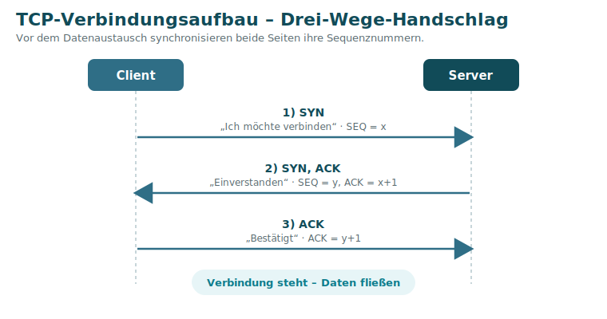

# 6 · Schicht 4 – Transport

Die Transportschicht regelt die **Ende-zu-Ende-Verbindung zwischen zwei Anwendungen**. Sie nutzt **Ports**, um mehrere Verbindungen auf einem Rechner auseinanderzuhalten, und bietet – je nach Protokoll – Zuverlässigkeit oder Geschwindigkeit.

## Ports

Ein **Port** ist eine 16-Bit-Zahl (**0–65535**), die einen Dienst bzw. eine Verbindung adressiert. Zusammen mit der IP-Adresse ergibt sich ein **Socket** (`192.168.1.10:443`).

| Bereich | Name | Verwendung |
|---------|------|-----------|
| 0 – 1023 | **Well-Known Ports** | feste Dienste (HTTP 80, HTTPS 443, DNS 53 …) |
| 1024 – 49151 | **Registered Ports** | bei der IANA registrierte Anwendungen (z. B. RDP 3389) |
| 49152 – 65535 | **Dynamic / Private Ports** | **Quellports**, die der Client zufällig vergibt |

> 💡 Ruft ein Client einen Server an, ist der **Zielport** fest (z. B. 443), der **Quellport** wird **zufällig** aus dem dynamischen Bereich gewählt – so kann die Antwort eindeutig zugeordnet werden.

## TCP vs. UDP

| Eigenschaft | **TCP** (Transmission Control Protocol) | **UDP** (User Datagram Protocol) |
|-------------|------------------------------------------|----------------------------------|
| Verbindung | **verbindungsorientiert** (Handshake) | **verbindungslos** |
| Zuverlässigkeit | gesichert (Bestätigung + erneute Übertragung verlorener Segmente) | ungesichert (fehlerhafte Datagramme werden verworfen) |
| Reihenfolge | stellt korrekte Reihenfolge sicher | keine Garantie |
| Flusskontrolle | ja | nein |
| Tempo / Overhead | langsamer, mehr Overhead | schnell, wenig Overhead |
| PDU | Segment | Datagramm |
| Geeignet für | Web, Dateiübertragung, E-Mail | Echtzeit (Sprache, Spiele), DHCP, DNS |

### Welche Anwendung nutzt was? (aus dem Kurs)

| TCP | UDP |
|-----|-----|
| HTTP(S), FTP, SSH, SMTP | VoIP, Online-Spiele, DHCP |

## Der TCP-Verbindungsaufbau (Drei-Wege-Handschlag)

Bevor Daten fließen, synchronisieren beide Seiten ihre Sequenznummern:

1. **SYN** – Client: „Ich möchte verbinden“ (SEQ = x)
2. **SYN, ACK** – Server: „Einverstanden“ (SEQ = y, ACK = x+1)
3. **ACK** – Client: „Bestätigt“ (ACK = y+1)

Danach ist die Verbindung aufgebaut und der Datenaustausch beginnt. Beendet wird sie geordnet mit **FIN/ACK**.

> Genau diese Garantien fehlen **UDP** – dafür ist es ohne Handshake sofort startklar und damit ideal für **Echtzeit**, wo ein verspätetes Paket nutzloser wäre als ein verlorenes.

---
[◀ Subnetting](05-IP-Adressierung-und-Subnetting.md) · [Übersicht](README.md) · **Weiter:** [Schicht 5–7 – Anwendung ▶](07-Schicht-5-7-Anwendung.md)
