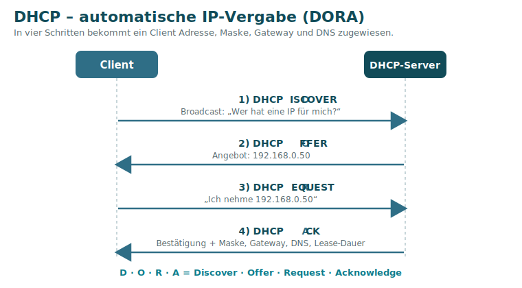
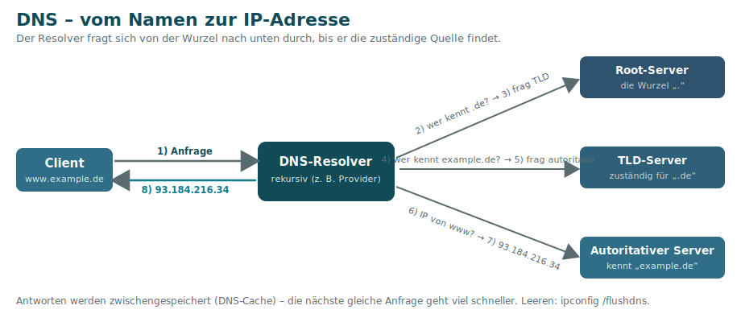

# 7 · Schicht 5–7 – Anwendung

Die oberen drei Schichten (Sitzung, Darstellung, Anwendung) werden in der Praxis meist zusammengefasst betrachtet. Hier liegen die **Dienste**, mit denen Anwender und Anwendungen direkt arbeiten. Diese Seite stellt die wichtigsten **Netzwerkdienste** des Lernfelds vor.

## DHCP – automatische IP-Vergabe

**DHCP** (Dynamic Host Configuration Protocol) vergibt Geräten automatisch **IP-Adresse, Subnetzmaske, Standardgateway und DNS-Server** – inklusive einer **Lease-Dauer**. Es nutzt **UDP** (Ports 67/68).

Der Ablauf heißt **DORA**:

| Schritt | Nachricht | Inhalt |
|:------:|-----------|--------|
| **D** | DHCP**DISCOVER** | Client per Broadcast: „Wer hat eine IP für mich?“ |
| **O** | DHCP**OFFER** | Server bietet eine Adresse an |
| **R** | DHCP**REQUEST** | Client: „Ich nehme diese Adresse“ |
| **A** | DHCP**ACK** | Server bestätigt + liefert Maske, Gateway, DNS, Lease |

- **Verteilte Parameter:** IP-Adresse, Subnetzmaske, Standard-Gateway, DNS-Server – dazu optional NTP-/Mail-Server, Lease-Dauer u. v. m.
- **Lease-Time:** Reservierungsdauer der IP. Nach der **Hälfte** erneuert der Client sie (DHCP-Request) und behält meist **dieselbe** Adresse.
- Der **Discover** ist ein **Broadcast** (UDP, Ziel `255.255.255.255`, Quelle `0.0.0.0`).

> Schlägt DHCP fehl, vergibt sich der Client eine **APIPA-Adresse** `169.254.x.x` (auf Nicht-Windows-Systemen **Zeroconf**) – siehe [Schicht 3](04-Schicht-3-Vermittlung.md#apipa--wenn-dhcp-versagt).

## DNS – Namensauflösung

**DNS** (Domain Name System) übersetzt **Namen** (`www.example.de`) in **IP-Adressen** (`93.184.216.34`) und umgekehrt. Port **53** (meist UDP). Ohne DNS müsste man sich IP-Adressen merken.

- **Auflösungsreihenfolge** am Client: **1. DNS-Cache → 2. hosts-Datei → 3. DNS-Server**.
- Der **Resolver** fragt sich dann hierarchisch durch: **Root → TLD (`.de`) → autoritativer Server (`example.de`)**. Es gibt **13 Root-Server** (per **Anycast** vielfach gespiegelt). Ein vollständig qualifizierter Name heißt **FQDN** (z. B. `www.gfn.de.`).
- Ergebnisse werden im **DNS-Cache** zwischengespeichert (leeren: `ipconfig /flushdns`).
- Wichtige Einträge: **A** (Name → IPv4), **AAAA** (Name → IPv6), **MX** (Mailserver), **CNAME** (Alias).
- Testwerkzeug: **`nslookup`**.

> Typisches Symptom eines DNS-Problems: `ping 8.8.8.8` funktioniert, `ping www.google.de` nicht.

## HTTP / HTTPS – das Web

- **HTTP** (Port **80**) überträgt Webseiten – im Klartext.
- **HTTPS** (Port **443**) ist HTTP **über TLS** → verschlüsselt und authentifiziert. Standard im heutigen Web.

## FTP – Dateiübertragung

- **FTP** (File Transfer Protocol, Ports **21** Steuerung / **20** Daten) überträgt Dateien – unverschlüsselt.
- Sichere Varianten: **FTPS** (FTP über TLS) und **SFTP** (über SSH).

## E-Mail

| Aufgabe | Protokoll | Port (Standard / verschlüsselt) |
|---------|-----------|-------------------------------|
| **Senden** | SMTP | 25 / 587 (Submission) |
| **Abholen (lokal speichern)** | POP3 | 110 / 995 |
| **Abholen (auf Server lassen)** | IMAP | 143 / 993 |

## SSH – sicherer Fernzugriff

**SSH** (Secure Shell, Port **22**, **TCP**) ermöglicht die verschlüsselte Fernsteuerung und Dateiübertragung – der sichere Nachfolger von Telnet.

> Eine vollständige Übersicht aller Ports findest du in der [Protokoll- & Port-Referenz](10-Protokoll-und-Port-Referenz.md).

---
[◀ Schicht 4](06-Schicht-4-Transport.md) · [Übersicht](README.md) · **Weiter:** [Netzwerkgeräte ▶](08-Netzwerkgeraete.md)
