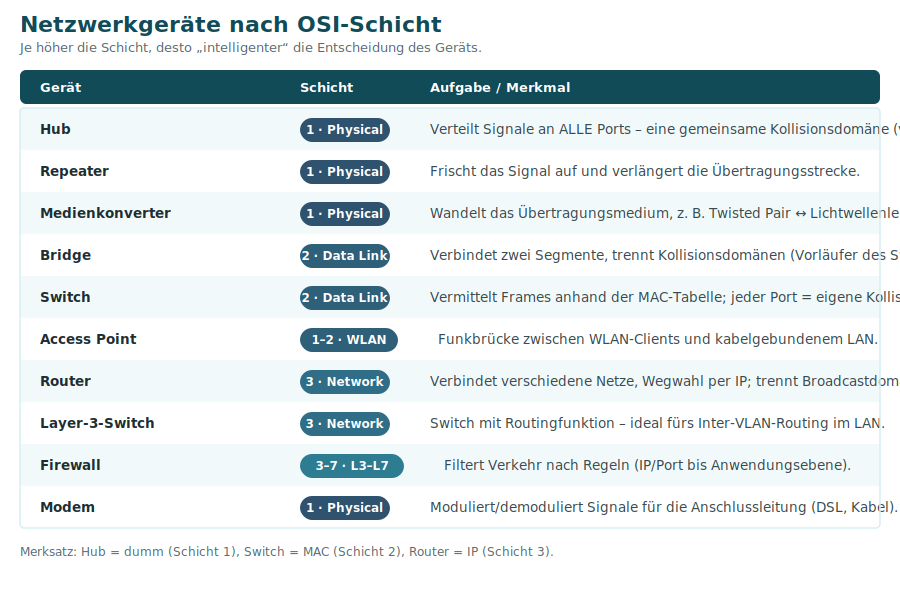

# 8 · Netzwerkgeräte im Überblick

Jedes Netzwerkgerät lässt sich einer **OSI-Schicht** zuordnen – je höher die Schicht, desto „intelligenter“ seine Entscheidung. Diese Seite fasst alle Geräte des Lernfelds zusammen.

## Schicht 1 – arbeiten mit Signalen

| Gerät | Aufgabe |
|-------|---------|
| **Hub** | Verteilt eingehende Signale an **alle** Ports. Bildet **eine** Kollisionsdomäne → veraltet. |
| **Repeater** | Frischt das Signal auf und **verlängert** die Strecke. |
| **Medienkonverter** | Wandelt das **Medium**, z. B. Twisted Pair ↔ Lichtwellenleiter. |
| **Modem** | **Mo**duliert/**dem**oduliert Signale für die Anschlussleitung (DSL, Kabel). |

## Schicht 2 – arbeiten mit MAC-Adressen

| Gerät | Aufgabe |
|-------|---------|
| **Switch** | Vermittelt Frames anhand der **MAC-Tabelle**. Jeder Port = eigene Kollisionsdomäne, Vollduplex. Unterstützt **VLANs**. |
| **Bridge** | Verbindet zwei Segmente und trennt Kollisionsdomänen – der „Vorfahre“ des Switch. |
| **Access Point** | Funkbrücke zwischen WLAN-Clients und kabelgebundenem LAN (Schicht 1–2). |

## Schicht 3 – arbeiten mit IP-Adressen

| Gerät | Aufgabe |
|-------|---------|
| **Router** | Verbindet **verschiedene Netze**, trifft die **Wegwahl** per IP, **trennt Broadcastdomänen**, macht NAT. |
| **Layer-3-Switch** | Switch **mit Routingfunktion** – ideal fürs schnelle **Inter-VLAN-Routing** im LAN. |

## Schicht 3–7 – arbeiten mit Regeln

| Gerät | Aufgabe |
|-------|---------|
| **Firewall** | Filtert Verkehr nach **Regeln** – von IP/Port (Schicht 3/4) bis zur Anwendungsebene (Schicht 7). Siehe [Sicherheit](09-Sicherheit-Firewall-DMZ-WLAN.md). |

## Speicher im Netzwerk (NAS & SAN)

| | **NAS** (Network Attached Storage) | **SAN** (Storage Area Network) |
|--|-----------------------------------|--------------------------------|
| Zugriff | **dateibasiert** (NFS, SMB) | **blockbasiert** (wie eine lokale Platte) |
| Netz | über das normale **LAN** | eigenes **Speichernetz** (Fibre Channel, iSCSI) |
| Einsatz | Dateifreigaben, Backups | Datenbanken, virtuelle Maschinen, hohe Last |

## Merksätze

- **Hub = dumm (Schicht 1)** · **Switch = MAC (Schicht 2)** · **Router = IP (Schicht 3)**.
- Ein **Switch** trennt Kollisionsdomänen, ein **Router** trennt Broadcastdomänen.
- Ein **Layer-3-Switch** ist ein Switch, der auch routen kann.

---
[◀ Schicht 5–7 – Anwendung](07-Schicht-5-7-Anwendung.md) · [Übersicht](README.md) · **Weiter:** [Sicherheit: Firewall, DMZ & WLAN ▶](09-Sicherheit-Firewall-DMZ-WLAN.md)
