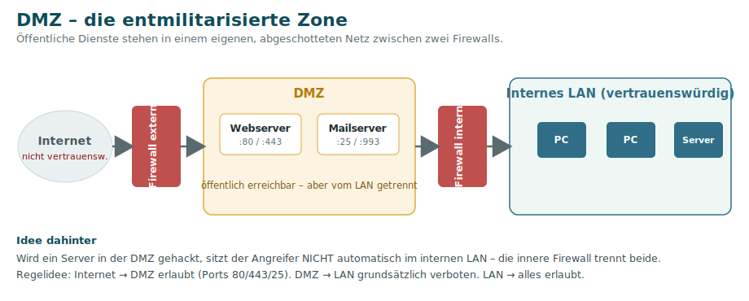

# 9 · Sicherheit: Firewall, DMZ & WLAN

## Firewall & Paketfilter

Eine **Firewall** kontrolliert den Datenverkehr zwischen Netzen anhand von **Regeln**. Ein einfacher **Paketfilter** entscheidet anhand von **Quell-/Ziel-IP, Port und Protokoll**, ob ein Paket erlaubt (*Allow/Permit*) oder verworfen (*Deny*) wird. Eine **Stateful** Firewall merkt sich zusätzlich den Verbindungszustand.

### ACL – Access Control List

Die Regelliste einer Firewall/eines Routers heißt **ACL (Access Control List)**. Sie **erlaubt (Permit)** oder **verbietet (Deny)** Verkehr und wird am Interface als **Ingress** (eingehend) oder **Egress** (ausgehend) angewendet. ACLs werden auch zur Klassifizierung für **NAT** und **[QoS](11-QoS-Priorisierung.md)** genutzt.

**Filterkriterien:** Quell-IP, Ziel-IP, TCP-/UDP-Port, ICMP – teils auch Anwendung oder Tageszeit.

### ⚠️ Die Regelreihenfolge ist entscheidend

Regeln werden **von oben nach unten** abgearbeitet – die **erste passende Regel gewinnt** (*first match*), der Rest wird ignoriert.

**Falsche Reihenfolge** (die spezielle Erlaubnis steht hinter dem allgemeinen Verbot):

| Nr. | Aktion | von | nach |
|----:|--------|-----|------|
| 1 | **Deny** | 10.0.0.0/24 | 192.168.0.0/24 |
| 2 | Allow | 10.0.0.1 | 192.168.0.2 |
| 999 | Deny | any | any |

→ Paket `10.0.0.1 → 192.168.0.2` trifft **Regel 1 (Deny)** und wird verworfen. **Regel 2 wird nie gelesen.**

**Richtige Reihenfolge** (speziell vor allgemein):

| Nr. | Aktion | von | nach |
|----:|--------|-----|------|
| 1 | **Allow** | 10.0.0.1 | 192.168.0.2 |
| 2 | Deny | 10.0.0.0/24 | 192.168.0.0/24 |
| 999 | Deny | any | any |

→ `10.0.0.1 → 192.168.0.2` kommt durch; alle anderen aus dem Netz werden geblockt. ✅

**Grundregeln:**
- **Spezifische** Regeln **vor** allgemeine Regeln.
- Am Ende steht ein **implizites Deny** (`Deny any any`): Alles, was nicht ausdrücklich erlaubt ist, wird verboten – auch wenn diese Regel nicht sichtbar angezeigt wird („Whitelist-Prinzip”).

## DMZ – die entmilitarisierte Zone

Server, die **aus dem Internet** erreichbar sein müssen (Web, Mail), gehören **nicht** ins interne LAN, sondern in eine eigene, abgeschottete Zone: die **DMZ**.

- Aufbau: **Internet → äußere Firewall → DMZ → innere Firewall → internes LAN**.
- **Idee:** Wird ein Server in der DMZ kompromittiert, sitzt der Angreifer **nicht** automatisch im internen LAN – die innere Firewall trennt beide.
- **Typische Regeln:** Internet → DMZ erlaubt (nur nötige Ports wie 80/443/25); **DMZ → LAN grundsätzlich verboten**; LAN → DMZ/Internet erlaubt.

## WLAN – drahtlose Netze (IEEE 802.11)

### Frequenzbänder

| Band | Vorteile | Nachteile |
|------|----------|-----------|
| **2,4 GHz** | große Reichweite, durchdringt Wände besser | viele Störquellen; in DE nur **3 überlappungsfreie Kanäle** (1, 6, 11) |
| **5 GHz** | deutlich schneller, störungsärmer; in DE **19** Kanäle | geringere Reichweite, von Wänden stärker gedämpft |
| **6 GHz** | nochmals schneller, kaum genutzt | wandempfindlich; nur neueste Geräte (Wi-Fi 6E/7) |

> 💡 **Faustregel:** niedrige Frequenz = mehr Reichweite, hohe Frequenz = mehr Tempo (aber kürzere Reichweite).

### Betriebsmodi
- **Infrastructure-Modus:** Geräte verbinden sich über einen **Access Point** mit dem LAN (Normalfall).
- **Ad-hoc-Modus:** Geräte verbinden sich **direkt** ohne Infrastruktur, gleichberechtigt.

### 802.11-Standards (Wi-Fi-Generationen)

| Generation | Standard | Band(er) | max. Brutto-Rate |
|------------|----------|----------|------------------|
| Wi-Fi 4 | 802.11n | 2,4 / 5 GHz | 600 Mbit/s |
| Wi-Fi 5 | 802.11ac | 5 GHz | ~6,9 Gbit/s |
| Wi-Fi 6 | 802.11ax | 2,4 / 5 GHz | ~9,6 Gbit/s |
| Wi-Fi 6E | 802.11ax | + 6-GHz-Band | wie Wi-Fi 6 |
| Wi-Fi 7 | 802.11be | 2,4 / 5 / 6 GHz | bis ~46 Gbit/s |

Ältere Standards: 802.11a/b/g (11–54 Mbit/s). Höhere Raten entstehen durch **Kanalbündelung**, dichtere Modulation und mehr **MIMO-Streams**; **Wi-Fi 7** bringt **Multi-Link-Operation**.

### Verschlüsselung

Im WLAN sendet man über den **freien Raum** – jeder kann mithören. Nur **Verschlüsselung** schützt.

| Verfahren | Technik | Sicherheit |
|-----------|---------|------------|
| **WEP** | RC4 | ❌ seit 2001 geknackt – nie verwenden |
| **WPA** | RC4 + **TKIP** | ⚠️ nur Übergangslösung |
| **WPA2-Personal** | **AES**, Login per **PSK** (WLAN-Passwort) | ✅ mit gutem Passwort weiterhin sicher |
| **WPA2-Enterprise** | AES + **Auth-Server (RADIUS)** | ✅ zentrale Anmeldung, dynamisches VLAN möglich |
| **WPA3** | **SAE** | ✅✅ aktueller Standard |

- **WPA3/SAE:** Das Passwort wird **nie übertragen**; schützt vor **Wörterbuch-** und **Man-in-the-Middle-Angriffen**, selbst aufgezeichnete Pakete bleiben unentschlüsselbar.
- Die **SSID** (Netzname) kann verborgen werden – Verbindung dann nur mit bekanntem Namen (kein echter Schutz).

### Störungen & Platzierung
- **Interferenz** durch Mikrowellen, DECT-Telefone, Bluetooth, Leuchtstofflampen und **benachbarte WLANs** auf demselben Kanal.
- **Access Point** möglichst **hoch, zentral und frei** aufstellen; bei Bedarf **freien Kanal** manuell wählen, Repeater oder zweiten AP ergänzen.

> 🔧 Konkrete Schritt-für-Schritt-Fehlersuche (auch für WLAN) auf der Seite [13 · Troubleshooting](13-Troubleshooting.md).

---
[◀ Netzwerkgeräte](08-Netzwerkgeraete.md) · [Übersicht](README.md) · **Weiter:** [Priorisierung & QoS ▶](11-QoS-Priorisierung.md)
