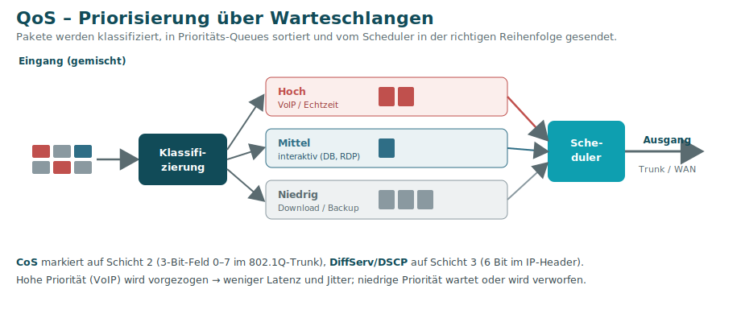

# 11 · Priorisierung von Netzwerkverkehr (QoS)

Nicht aller Verkehr ist gleich wichtig. Ein stockendes **VoIP-Gespräch** ist viel ärgerlicher als eine **E-Mail**, die eine Sekunde später ankommt. **QoS (Quality of Service)** sorgt dafür, dass kritische Dienste die nötige Qualität bekommen. Das Thema betrifft **Schicht 2 (CoS)** und **Schicht 3 (DiffServ)**.

## Warum priorisieren? – Unterschiedliche Anforderungen

| Anwendungstyp | Anforderung |
|---------------|-------------|
| **Echtzeit** (VoIP, Voice-Chat) | sehr **geringe Latenz**, stabile Verbindung |
| **Streaming** | unkritischer – kurze Verzögerungen per **Puffer** ausgleichbar |
| **Interaktiv** (Datenbank, Remote-Desktop) | zeitkritisch – sofortige Rückmeldung erwartet |
| **Kritische Anwendungen** | haben Vorrang – Ausfall hätte gravierende Folgen |

## Traffic Shaping & QoS

- **Traffic / Packet Shaping** steuert Datenraten: Pakete werden ggf. **verzögert** oder in **Warteschlangen** gehalten, um Staus zu vermeiden.
- **QoS** ist der **Gesamtprozess**: Zuweisung von **Mindestbandbreiten**, **Priorisierung** wichtiger Ströme, **Begrenzung** unwichtiger Anwendungen.
- Ziel: weniger **Latenz** (Verzögerung) und **Jitter** (Schwankung der Verzögerung), besonders für Echtzeit.

## Zwei Mechanismen: CoS und DiffServ

| | **CoS** – Class of Service | **DiffServ** – Differentiated Services |
|---|---|---|
| **OSI-Schicht** | **2** (Data Link) | **3** (Vermittlung) |
| **Wo markiert?** | im **802.1Q-Tag** eines Trunks | im **IP-Header** |
| **Feld** | 3-Bit-CoS-Feld (**0–7**) | **DSCP** (6 Bit) im **ToS**-Feld (IPv4) bzw. **Traffic-Class** (IPv6) |
| **Wer markiert?** | Switch im Trunk | i. d. R. **Router/Firewall** (nicht die Applikation!) |
| **Reichweite** | internes Netz | netzwerkweit, **Per-Hop-Behavior** |

> 📌 Die QoS-Bits werden **nicht von der Anwendung** gesetzt – ein Netzwerkgerät klassifiziert die Pakete nach Regeln (oft per [ACL](09-Sicherheit-Firewall-DMZ-WLAN.md)).

## Umsetzung: Warteschlangen & Scheduling

1. Ankommende Pakete werden nach **Priorität erkannt** und in die passende **Warteschlange (Queue)** gelegt.
2. **Scheduling-Algorithmen** bestimmen, **wann** und **wie viele** Pakete eine Queue verlassen.
3. Pakete mit **niedriger Priorität** warten – und können im Notfall **verworfen** werden.

---
[◀ Sicherheit](09-Sicherheit-Firewall-DMZ-WLAN.md) · [Übersicht](README.md) · **Weiter:** [WAN & Internetzugang ▶](12-WAN-Internetzugang.md)

*Quelle: Handout „LF09 Tag 04-3 – 9.3.4 Priorisierung von Netzwerkverkehr".*
