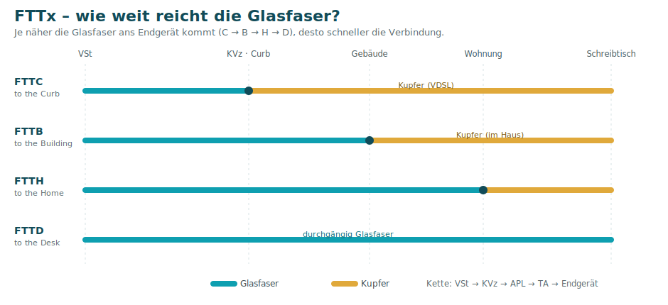

# 12 · WAN – Internetzugang

Ein **WAN** (Wide Area Network) verbindet weit entfernte Netze – typischerweise das eigene LAN mit dem **Internet**. Dieses Kapitel ordnet die **Zugangstechniken** ein. (Das eng verwandte Thema **NAT** steht auf der Seite [Schicht 3](04-Schicht-3-Vermittlung.md#nat--network-address-translation).)

## Zugangstechniken im Überblick

| Technik | Medium | Geschwindigkeit (Richtwert) |
|---------|--------|------------------------------|
| **Dialup** (Einwahl) | Telefonleitung (Töne) | bis 56 kbit/s – *historisch* |
| **Kabel** (DOCSIS) | TV-Kabelnetz | 4 Mbit/s – 10 Gbit/s |
| **DSL** (ADSL/SDSL) | Telefon-Kupfer | bis ~25 Mbit/s |
| **VDSL** (FTTC) | Glasfaser + Kupfer | bis ~250–400 Mbit/s |
| **GPON** (FTTB/H/D) | Glasfaser | bis ~1 Gbit/s |
| **Satellit** | Funk zum Satelliten | siehe unten |
| **Mobilfunk** | Funkzellen (1G–5G) | siehe unten |

- **DOCSIS** = *Data Over Cable Service Interface Specification* – Daten über das (geteilte) TV-Kabel.
- **DSL**: *asymmetrisch* (ADSL, Download > Upload) vs. *symmetrisch* (SDSL).
- **Dialup**: pro Leitung entweder telefonieren **oder** surfen.

## FTTx – „Fibre to the …"

Je näher die Glasfaser ans Endgerät reicht, desto schneller:

| Kürzel | Glasfaser bis … | danach Kupfer bis … |
|--------|-----------------|---------------------|
| **FTTC** | Kabelverzweiger (Curb) | Endgerät (VDSL) |
| **FTTB** | Gebäude (Building) | Wohnung |
| **FTTH** | Wohnung (Home) | Endgerät |
| **FTTD** | **durchgängig** bis zum Schreibtisch (Desk) | – |

*Verkabelungskette:* TE (Endgerät) → TA (Anschluss) → APL (Hausabschluss) → KVz (Kabelverzweiger) → VSt (Vermittlungsstelle).

## Satellit & Mobilfunk

| | Geostationär | Starlink (LEO) |
|--|--------------|----------------|
| Download / Upload | ~15 / 2 Mbit/s | ~200 / 70 Mbit/s |
| Latenz | 250–600 ms | < 50 ms |
| Umlaufbahn | > 30.000 km | ~500 km (vermascht) |

| Gen | Technik | Geschwindigkeit | Latenz |
|-----|---------|-----------------|--------|
| **2G** | GSM/GPRS/EDGE | bis 384 kbit/s | – |
| **3G** | UMTS/HSPA+ | bis 42 Mbit/s | 60–200 ms |
| **4G** | LTE / LTE-A | bis 1 Gbit/s | 10–40 ms |
| **5G** | 5G | bis 20 Gbit/s | 1–5 ms |

> **Tethering** = Mobilgerät als Router/Hotspot. Satellit braucht **freie Sicht**; Wetter beeinträchtigt die Qualität.

## Warum WAN ohne IPv4-Adressen nicht auskommt

**IPv4 ist erschöpft** (~4,3 Mrd. Adressen, aber > 20 Mrd. Geräte). Deshalb nutzt man im LAN **private Adressen** (RFC 1918) und tritt nach außen per **NAT/PAT** mit einer öffentlichen IP auf. Für intern erreichbare Server gibt es **Destination NAT (Portweiterleitung)** – aber **nur mit [DMZ](09-Sicherheit-Firewall-DMZ-WLAN.md) absichern!**

---
[◀ QoS](11-QoS-Priorisierung.md) · [Übersicht](README.md) · **Weiter:** [Troubleshooting ▶](13-Troubleshooting.md)

*Quelle: Handout „LF09 Tag 07 – 9.7 WAN (Internetverbindungen & NAT)".*
