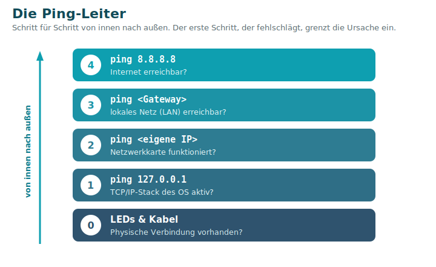

# 13 · Troubleshooting in Netzwerken

> *„Wenn ein Netzwerk funktioniert, interessiert es niemanden – wenn nichts mehr geht, interessiert sich plötzlich jeder dafür!"*

Fehlersuche gelingt **systematisch von unten nach oben** (Bottom-Up nach [OSI](01-OSI-Modell.md)): erst die Physik, dann IP, dann Namen/Dienste. Wer planlos probiert, verliert Zeit.

## Keine Verbindung – die Ping-Leiter

Arbeite dich von **innen nach außen** durch. Der **erste Schritt, der fehlschlägt**, grenzt die Ursache ein.

| Schritt | Prüfung | Schlägt fehl → Problem liegt bei |
|:------:|---------|----------------------------------|
| 0 | **LEDs & Kabel** an der Netzwerkkarte | physische Verbindung (Kabel, Port, NIC) |
| 1 | `ping 127.0.0.1` (Loopback) | TCP/IP-Stack / IP-Konfiguration des OS |
| 2 | `ping <eigene IP>` | Netzwerkkarte / lokale Konfiguration |
| 3 | `ping <Default Gateway>` | Kabel, Switch, Subnetz, Gateway (LAN) |
| 4 | `ping 8.8.8.8` | Router, Internetzugang, NAT/Firewall |

> 💡 Klappt `8.8.8.8`, aber kein **Name** (z. B. `ping www.google.de`) → **DNS-Problem** ([nslookup](#cli-werkzeuge)). Unter Windows öffnet `ncpa.cpl` schnell die Netzwerkverbindungen.

## Typische Fehlerbilder

### APIPA – die 169.254-Adresse
Bekommt ein Gerät **per DHCP keine Adresse**, vergibt es sich selbst eine aus `169.254.0.0/16` (link-lokal, **nicht geroutet**); anschließend prüft es per **ARP**, ob sie einzigartig ist. Eine **169.254.x.x-Adresse ist das klare Indiz: DHCP nicht erreichbar** → Kabel, Switch und DHCP-Server prüfen, `ipconfig /release` + `/renew`.

### IP-Konflikt
Zwei Geräte mit **derselben** IP. DHCP verhindert Doppelvergaben – **feste** IPs können aber kollidieren. Windows meldet den Konflikt; die Verbindung wird unzuverlässig. **Lösung:** doppelte feste IP ändern oder DHCP nutzen, dann Adapter/Rechner neu starten.

### Ständige Unterbrechungen
Fast immer **physisch**: Wackelkontakt, nicht eingerasteter Stecker (abgebrochene Nase), defektes Kabel, defekte Netzwerkkarte oder defekter Switch/Access Point. Gelbes Dreieck im Netzwerksymbol beachten; Komponenten systematisch tauschen.

### Langsames Netzwerk
- **Komponenten überlastet?** (Router, Switches)
- **Speed-/Duplex-Mismatch:** eine Seite 100 Mbit/Half, die andere 1 Gbit/Full → Einbrüche.
- **Hardware/Kabel defekt** → durch Austausch testen.
- **Malware** kann alles ausbremsen → Scan.

## WLAN-Probleme

- **Interferenz / schlechtes Signal:** anderer Funk auf der Frequenz (Mikrowelle, DECT, Nachbar-WLANs); Sendeleistung/Antennen prüfen; **freien Kanal** wählen; AP **hoch & zentral** aufstellen; ggf. Repeater oder zweiter AP.
- **SNR (Signal-to-Noise-Ratio):** das Nutzsignal muss deutlich **über dem Rauschen** liegen.
- **WLAN wird nicht gefunden:** zu weit entfernt / von stärkeren Netzen übertönt, oder die **SSID ist verborgen** (Verbindung nur mit bekanntem Namen).

> Mehr zu Bändern, Kanälen und Verschlüsselung: [Sicherheit → WLAN](09-Sicherheit-Firewall-DMZ-WLAN.md#wlan--drahtlose-netze-ieee-80211).

## CLI-Werkzeuge

| Befehl (Windows) | Zweck | Wichtige Optionen |
|------------------|-------|-------------------|
| `ping <Ziel>` | Erreichbarkeit + Laufzeit (ICMP) | `ping 8.8.8.8` |
| `ipconfig` | IP-Konfiguration der Adapter | `/all`, `/release`, `/renew`, `/displaydns`, `/flushdns` |
| `tracert <Ziel>` | ganzer Weg (Hops) per TTL | wird oft von Firewalls (ICMP) geblockt |
| `nslookup <Name/IP>` | DNS-Auflösung testen | `nslookup www.heise.de` |
| `netstat` | aktive Verbindungen & Ports | `-a`, `-b` (Programm, **als Admin**), `-n` (nur IPs) |
| `net` | Dienste & Freigaben | `net start/stop <Dienst>`, `net use`, `net view` |

- `ipconfig /flushdns` leert den DNS-Cache (hilft bei veralteten Einträgen).
- `tracert` schickt Pakete mit **steigender TTL** (1 → 1. Router, 2 → 2. Router …), so wird der Weg sichtbar.
- `netstat -b` muss **als Administrator** laufen.

> 🧰 **Merkhilfe – Reihenfolge der Diagnose:** **Schaut's? → `ping` → `ipconfig` → `tracert` → `nslookup` / `netstat`.**

---
📄 **Kurzreferenz aller Befehle:** [14 · CLI-/PowerShell-Spickzettel](14-CLI-PowerShell-Spickzettel.md)

[◀ WAN & Internetzugang](12-WAN-Internetzugang.md) · [Übersicht](README.md) · **Weiter:** [Protokoll- & Port-Referenz ▶](10-Protokoll-und-Port-Referenz.md)

*Quelle: Handout „LF09 Tag 10 – Troubleshooting in Netzwerken".*
